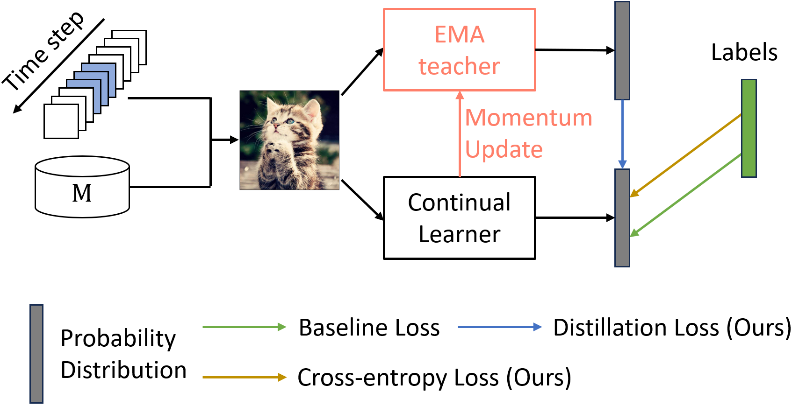

Implementation of our paper titled "Rethinking Momentum Knowledge Distillation in Online Continual Learning"
==========================================
The paper has been accepted at ICML 2024.



# Project structure

```bash
.
├── config
│   ├── icml24
│   │   └── all              # configs files
│   ├── parser.py            # define all command line arguments
├── logs                     # some logs
├── main.py
├── readme.md                # this file
├── requirements.txt
├── results                  # accuracy and params used is saved here
├── src
│   ├── buffers             # A lot of buffers. Only reservoir is used.
│   ├── datasets            # dataset definitions
│   ├── learners
│   │   ├── baselines       # original methods
│   │   │   ├── agem.py
│   │   │   ├── derpp.py
│   │   │   ├── dvc.py
│   │   │   ├── er_ace.py
│   │   │   ├── er.py
│   │   │   ├── gsa.py
│   │   │   ├── ocm.py
│   │   │   ├── pcr.py
│   │   ├── base.py
│   │   ├── ce.py
│   │   ├── ema             # variations with MKD - EMA
│   │   │   ├── base_ema.py
│   │   │   ├── derpp_ema.py
│   │   │   ├── dvc_ema.py
│   │   │   ├── er_ace_ema.py
│   │   │   ├── er_ema.py
│   │   │   ├── gsa_ema.py
│   │   │   ├── ocm_ema.py
│   │   │   ├── pcr_ema.py
│   │   │   └── tens.py
│   │   ├── er_kdu.py
│   │   └── sdp
│   │       ├── derpp_sdp.py
│   │       ├── dvc_sdp.py
│   │       ├── er_ace_sdp.py
│   │       ├── er_sdp.py
│   │       ├── gsa_sdp.py
│   │       ├── ocm_ema.py
│   ├── models          # networks definitions
│   │   ├── cnn.py
│   │   ├── mlp.py
│   │   ├── pcr_resnet.py
│   │   ├── resnet.py
│   │   └── resnet_sdp.py
│   └── utils
│       ├── alias_multinomial.py
│       ├── augment.py
│       ├── data.py
│       ├── early_stopping.py      # deprecated
│       ├── losses.py
│       ├── metrics.py
│       ├── name_match.py         # here you can see all methods and buffer
│       ├── tensorboard.py      # deprecated
│       └── utils.py
├── sweeps              # sweeps logs when using sweep (with wandb)
└── wandb               # wanbd logs when using wandb
```

# Installation

It is recommended to use a virtualenv or docker to run this code. Corresponding dependencies can be found in `requirements.txt.` In you use pip you can run `pip install -r requirements.txt` to install required packages.

# Usage

Command line usage of the current repository is described here.

```bash
usage: main.py [-h] [--config CONFIG] [--train] [--test]
               [-b BATCH_SIZE] [--learning-rate LEARNING_RATE]
               [--momentum M] [--weight-decay W] [--optim {Adam,SGD}] [--save-ckpt]
               [--seed SEED] [--tag TAG]
               [--results-root RESULTS_ROOT] [--tensorboard] [--verbose]
               [--ckpt-root CKPT_ROOT] [--resume] [--model-state MODEL_STATE]
               [--buffer-state BUFFER_STATE] [--head HEAD] [--proj-dim PROJ_DIM]
               [--nb-channels NB_CHANNELS] [--eval-proj] [--pretrained]
               [--supervised] [--dim-int DIM_INT] [-nf NF]
               [--data-root-dir DATA_ROOT_DIR] [--min-crop MIN_CROP]
               [--dataset {cifar10,cifar100,tiny,imagenet100}]
               [--training-type {uni,inc,blurry}] [--n-classes N_CLASSES]
               [--img-size IMG_SIZE] [--num-workers NUM_WORKERS] [--n-tasks N_TASKS]
               [--labels-order LABELS_ORDER [LABELS_ORDER ...]]
               [--blurry-scale BLURRY_SCALE] [--temperature T] [--mem-size MEM_SIZE]
               [--mem-batch-size MEM_BATCH_SIZE] [--buffer BUFFER]
               [--drop-method {random}] [--mem-iters MEM_ITERS] [--learner LEARNER]
               [--eval-mem] [--eval-random]
               [--kornia] [--no-kornia] [--tf-type {full,partial}]
               [--derpp-alpha DERPP_ALPHA]
               [--derpp-beta DERPP_BETA] [--no-wandb] [--wandb-watch] [--sweep]

Pytorch implementation of various continual learners.

options:
  -h, --help            show this help message and exit
  --config CONFIG       Path to the configuration file for the training to launch.
  -b BATCH_SIZE, --batch-size BATCH_SIZE
                        mini-batch size (default: 10)
  --learning-rate LEARNING_RATE, -lr LEARNING_RATE
                        Initial learning rate
  --momentum M          momentum
  --weight-decay W, --wd W
                        weight decay (default: 0)
  --optim {Adam,SGD}
  --save-ckpt           whether to save chekpoints or not
  --seed SEED           Random seed to use.
  --tag TAG, -t TAG     Base name for graphs and checkpoints
  --results-root RESULTS_ROOT
                        Where you want to save the results ?
  --ckpt-root CKPT_ROOT
                        Directory where to save the model.
  --resume, -r          Resume old training. Setup model state and buffer state.
  --model-state MODEL_STATE
  --buffer-state BUFFER_STATE
  --head HEAD
  --proj-dim PROJ_DIM
  --nb-channels NB_CHANNELS
                        Number of channels for the input image.
  --eval-proj           Use projection for inference. (default is representation.)
  --pretrained          Use a pretrained model if available.
  --supervised          Pseudo labels or true labels ?
  --dim-int DIM_INT
  -nf NF                Number of feature for Resnet18. Set nf=20 for reduced
                        resnet18, nf=64 for full.
  --data-root-dir DATA_ROOT_DIR
                        Root dir containing the dataset to train on.
  --min-crop MIN_CROP   Minimum size for cropping in data augmentation. range (0-1)
  --dataset {mnist,fmnist,cifar10,cifar100,tiny,sub,yt}, -d {mnist,fmnist,cifar10,cifar100,tiny,sub,yt}
                        Dataset to train on
  --training-type {uni,inc,blurry}
                        How to feed the data to the network (incremental context or
                        not)
  --n-classes N_CLASSES
                        Number of classes in database.
  --img-size IMG_SIZE   Size of the square input image
  --num-workers NUM_WORKERS, -w NUM_WORKERS
                        Number of workers to use for dataloader.
  --n-tasks N_TASKS     How many tasks do you want ?
  --labels-order LABELS_ORDER [LABELS_ORDER ...]
                        In which order to you want to see the labels ? Random if not
                        specified.
  --blurry-scale BLURRY_SCALE
  --temperature T       temperature parameter for softmax
  --mem-size MEM_SIZE   Memory size for continual learning
  --mem-batch-size MEM_BATCH_SIZE, -mbs MEM_BATCH_SIZE
                        How many images do you want to retrieve from the memory/ltm
  --buffer BUFFER       What buffer do you want ? See available buffers in
                        utils/name_match.py
  --mem-iters MEM_ITERS
                        Number of iterations on memory
  --learner LEARNER     What learner do you want ? See list of available learners in
                        utils/name_match.py
  --eval-mem
  --eval-random
  --n-runs N_RUNS       Number of runs, with different seeds each time.
  --kornia
  --no-kornia
  --n-augs N_AUGS
  --tf-type {full,partial}
                        Data augmentation sequence to use.
  --derpp-alpha DERPP_ALPHA
                        Values of alpha un der++ loss
  --derpp-beta DERPP_BETA
                        Values of beta un der++ loss
  --no-wandb
  --wandb-watch         Watch the models gradient and parameters into wandb (can be
                        slow).
  --sweep               Run the code with sweep for HP search.
```

# Training

## Command line only

Training can be done by specifying parameters in command line, for example:

```bash
python main.py --results-root results/cifar10/ --data-root /data/dataset/torchvision --learner ER_EMA --dataset cifar10 --batch-size 10 --optim Adam --learning-rate 0.0005
```

## Using a configuration file (recommended)

When using a configuration file, parameters specified in the .yaml cannot be overriten by command line arguments. However, other parameters like `--data-root` can be adapted to the users' need.

```bash
python main.py --data-root /data/dataset/torchvision --config config/icml24/all/ER,cifar10,m1000mbs64sbs10,blurry500.yaml
```

## output example

Output of the command above should contain performances like this.

```bash
    root - INFO - --------------------FORGETTING--------------------
    root - INFO - ncm     0.0000   nan      nan      nan      nan      0.0000
    root - INFO - ncm     0.2885   0.0000   nan      nan      nan      0.2885
    root - INFO - ncm     0.2935   0.2225   0.0000   nan      nan      0.2580
    root - INFO - ncm     0.4615   0.3190   0.0370   0.0000   nan      0.2725
    root - INFO - ncm     0.5815   0.2155   0.1795   0.0250   0.0000   0.2504
    root - INFO - --------------------ACCURACY--------------------
    root - INFO - ncm     0.7750   nan      nan      nan      nan      0.7750
    root - INFO - ncm     0.4865   0.5260   nan      nan      nan      0.5062
    root - INFO - ncm     0.4815   0.3035   0.5150   nan      nan      0.4333
    root - INFO - ncm     0.3135   0.2070   0.4780   0.2875   nan      0.3215
    root - INFO - ncm     0.1935   0.3105   0.3355   0.2625   0.3045   0.2813
```

# Cite

```latex
@InProceedings{pmlr-v235-michel24a,
  title = 	 {Rethinking Momentum Knowledge Distillation in Online Continual Learning},
  author =       {Michel, Nicolas and Wang, Maorong and Xiao, Ling and Yamasaki, Toshihiko},
  booktitle = 	 {Proceedings of the 41st International Conference on Machine Learning},
  pages = 	 {35607--35622},
  year = 	 {2024},
  editor = 	 {Salakhutdinov, Ruslan and Kolter, Zico and Heller, Katherine and Weller, Adrian and Oliver, Nuria and Scarlett, Jonathan and Berkenkamp, Felix},
  volume = 	 {235},
  series = 	 {Proceedings of Machine Learning Research},
  month = 	 {21--27 Jul},
  publisher =    {PMLR},
  pdf = 	 {https://raw.githubusercontent.com/mlresearch/v235/main/assets/michel24a/michel24a.pdf},
  url = 	 {https://proceedings.mlr.press/v235/michel24a.html},
  abstract = 	 {Online Continual Learning (OCL) addresses the problem of training neural networks on a continuous data stream where multiple classification tasks emerge in sequence. In contrast to offline Continual Learning, data can be seen only once in OCL, which is a very severe constraint. In this context, replay-based strategies have achieved impressive results and most state-of-the-art approaches heavily depend on them. While Knowledge Distillation (KD) has been extensively used in offline Continual Learning, it remains under-exploited in OCL, despite its high potential. In this paper, we analyze the challenges in applying KD to OCL and give empirical justifications. We introduce a direct yet effective methodology for applying Momentum Knowledge Distillation (MKD) to many flagship OCL methods and demonstrate its capabilities to enhance existing approaches. In addition to improving existing state-of-the-art accuracy by more than $10%$ points on ImageNet100, we shed light on MKD internal mechanics and impacts during training in OCL. We argue that similar to replay, MKD should be considered a central component of OCL. The code is available at https://github.com/Nicolas1203/mkd_ocl.}
}
```
